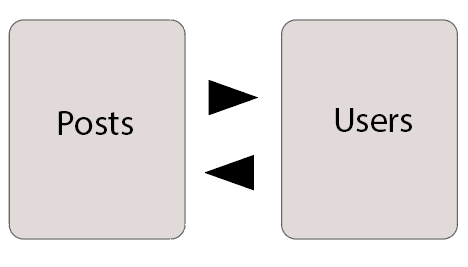

# Hi its me!

This app is a social tool modeled after Instagram, allowing users to post text updates in the feed and engage with posts by giving likes.

### Index

[Deploy](#deployd-🚀)

[Installation](#🔧-installation)

[Functionalities](#hammer-functionalities)


### Tech

- 
- 
- 
- 
- 

### Data Base

This app have users and posts related each other.



### Objective 📌

The application is a social networking platform focused on facilitating post sharing and interaction among users. Users have the ability to create posts, edit their own posts, and engage with posts created by other users by liking or disliking them. Additionally, users can explore a feed of posts from other users, providing a space for communication and expression within the community. 

### Deploy 🚀

https://hi-its-me-dev-sjmz.2.sg-1.fl0.io


### 🔧 Installation 

- Initial steps to run the proyect
- Clone de repository
- Install dependencies

``` bash
$ npm install
```

- Create a container in Docker with your credentials.
- Create the .env file and define your personal credentials to run the project.
- Run de seeder:

``` bash
$ npm run seed
```

- Initialize API

``` bash
$ npm run dev
```

``` bash
$ npm init --yes
```

``` bash
$ npm i express
```

``` bash
$ npm i nodemon -D 
```

``` bash
$ npm dotenv -E
```

``` bash
$ npm i mongoose -E
```

- installation Git

``` bash
$ git init
```
</br>

- Add type module to do import and export (avoid use "requires")


```sh
//(on package.json) 
//write before scripts:

{
    "type":"module"
}
```

``` bash
npm i mongoose
```

## :hammer: Functionalities

- `Auth endpoints`
- `User endpoints`
- `Post endpoints`

#### Predefined users and posts by seeder

``` sh

user/admin/superadmin
 {
            _id:"65f08bf319ed20287fd19c3a",
            name: "super_admin",
            email: "super_admin@super_admin.com",
            password: await bcrypt.hash("123456" , 8 ),
            role: "super_admin"

        },
        {
            _id: "65f08bf319ed20287fd19c3b",
            name: "admin",
            email: "admin@admin.com",
            password: await bcrypt.hash("123456" , 8 ),
            role: "admin"

        },
        {
            _id:"65f08bf319ed20287fd19c3c",
            name: "user",
            email: "user@user.com",
            password: await bcrypt.hash("123456" , 8 ),
            role: "user"

        }

posts

 {
                _id: "65f08bf319ed20287fd19c56",
                title: "el tituloooo",
                text: "Conscendo addo venia ubi ciminatio utpote uredo auctor cursus. Cometes…",
                nick: "65f08bf319ed20287fd19c3c"
    
            },
            {
                _id: "65f08bf319ed20287fd19c55",
                title: "el tituloooo2",
                text: "Conscendo addo venia ubi ciminatio utpote uredo auctor cursus. Cometes…",
                nick: "65f08bf319ed20287fd19c3c"
                
    
            },
            {
                _id: "65f08bf319ed20287fd19c54",
                title: "el tituloooo3",
                text: "Conscendo addo venia ubi ciminatio utpote uredo auctor cursus. Cometes…",
                nick: "65f08bf319ed20287fd19c3c"
               
    
            }

```


##### Make a register
POST https://hi-its-me-dev-sjmz.2.sg-1.fl0.io/api/auth/register 

<details>
- Make a register of one user ( default role is "user")

```sh
{
  "email": "user2@user2.com",
  "password":"123456"
}
```
</details>


</br>

##### Login of a user
POST https://hi-its-me-dev-sjmz.2.sg-1.fl0.io/api/auth/login

<details>
- Logged User have a token

```sh
{
  "email":"user2@user2.com",
  "password":"123456"
}
```
</details>
</br>

##### Retrieve all users 
GET https://hi-its-me-dev-sjmz.2.sg-1.fl0.io/api/users/

<details>
- Only for who had "super-admin" role.
- Add the user token on auth/ bearer.
- Retrieve all users.
</details>
</br>

##### Retrieve user profile
GET https://hi-its-me-dev-sjmz.2.sg-1.fl0.io/api/users/profile

<details>
- For all are logged users.
- This works for all users only for see their own profile.
- Add this user's token in auth/bearer too. 

```sh
//write this on body

{
  "email": "user2@user2.com",
  "password":"123456"
}
```
</details>

##### Delete a post
DELETE https://hi-its-me-dev-sjmz.2.sg-1.fl0.io/api/posts/:id

<details>

- Delete a post by id.
- It is only allowed for the owner of the post.
- Add User's token on Auth/Bearer.
</details>

##### Update a post
PUT https://hi-its-me-dev-sjmz.2.sg-1.fl0.io/api/posts/:id

<details>
- Update the title of a post by id.
- It is only allowed for the owner of the post.
- Add User's token on Auth/Bearer.

```sh
//write this on body
{
  "title": "feliz navidad"
}
```

</details>
</br>

##### Get all your own posts
GET https://hi-its-me-dev-sjmz.2.sg-1.fl0.io/api/posts/own

<details>

- Add User's token on Auth/Bearer.
</details>
</br>

##### Get all posts view feed
GET https://hi-its-me-dev-sjmz.2.sg-1.fl0.io/api/posts

<details>

- Add a token in Auth/Bearer because the watcher should be logged.
</details>
</br>

##### Get post by Id
GET https://hi-its-me-dev-sjmz.2.sg-1.fl0.io/api/posts/:id

<details>

- Add a token in Auth/Bearer because the watcher should be logged.
- Add postId in the request to find it.
</details>
</br>

##### Do Like and Unlike a post by Id
PUT https://hi-its-me-dev-sjmz.2.sg-1.fl0.io/api/posts/like/:id

<details>
- Add a token in Auth/Bearer because the watcher should be logged.

*bug* This only worked if you write true on body because the "botton: like" should be "pressedON" to allow the likes acount change true/false and show whose liked the post. SOLVED deleting like param.

</details>

### To add / Bugs
 
- I tried to add "name" parameter in body of users. But this hasnt control if name is different because in model is not required..
- Added 3 posts and 3 users default for some functionalities.

### Agreements

Thanks all for helping and support my progress in this proyect.

<a href="https://github.com/MartaGBayona">Marta
  
</a>

<a href="https://github.com/ariusvi">Ana
  

<a href="https://github.com/Eryhnar">Pedro


 <a href="https://github.com/Ferelbue">Fernando


<a href="https://github.com/CariblaGIT">Carlos


<a href="https://github.com/FRR95">Fran


